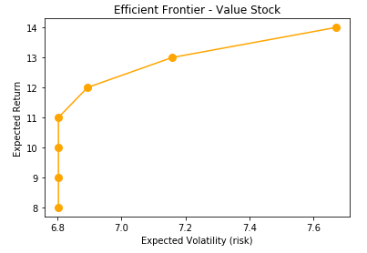
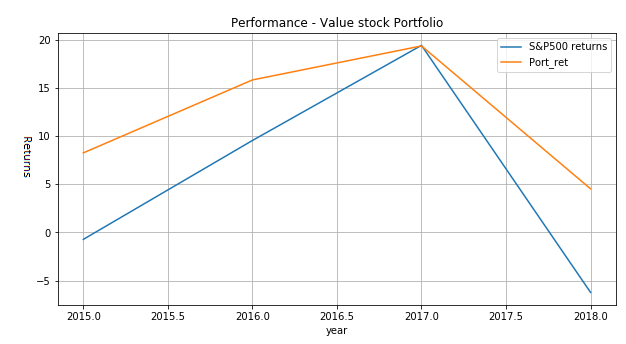
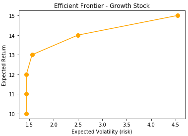
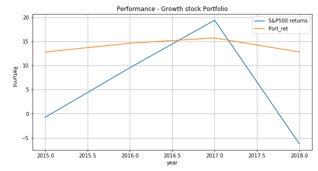
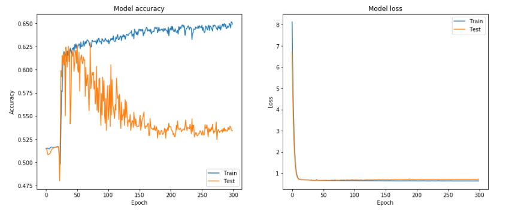
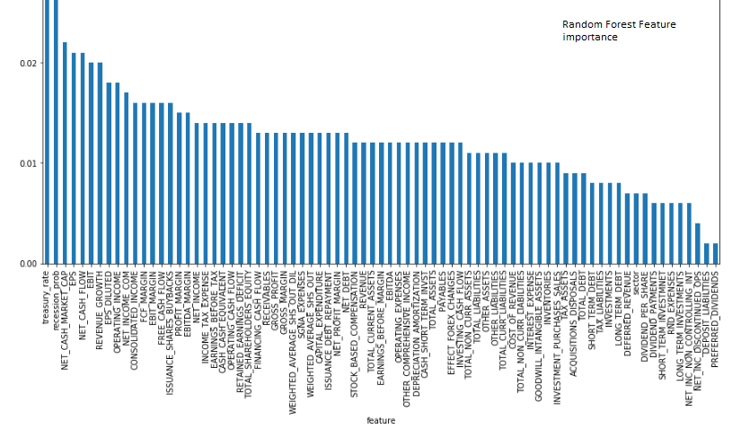
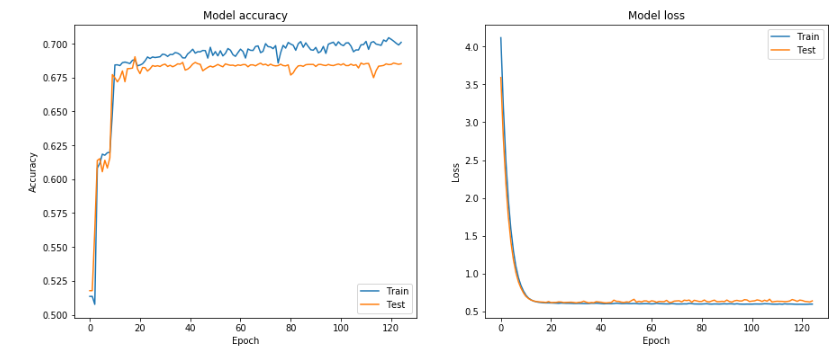

# Stock-Portfolio-Robo-Advisor

Stock Portfolio Robo advisor is the automatic stock portfolio construction and rebalancing software created. Using the listed company's financial statements, we built a customized model based on value investment and growth investment strategy to select stocks for Value and Growth portfolio. Also, we constructed a Machine Learning based model to identify the stocks which may perform better than the S&P 500 for the upcoming year.

Details of the projects can be found in the [project white paper](https://github.com/sushantsbelapurkar/Stock-Portfolio-Robo-Advisor/blob/master/1_Portfolio_Robo_Advisor_White_paper.pdf).

Technology and tools used: Python, MySQL, Machine Learning - Classification algorithms, Feature Engineering, cross validation, DNN, Keras. 

Concepts used: Financial Analytics-Value investment and growth investment, Sharpe Ratio,Modern Portfolio Theory(MPT), Optimization - To decide the weights of the stocks according to MPT.

[Dataset used](https://github.com/antoinevulcain/Financial-Modeling-Prep-API): Balance sheet, Cashflow statement, income statement, and historical returns of 5000+ listed stocks accross 4 exchanges comprise of more than two million rows.

#### Steps:
-	Calculate the intrinsic value of each stock - sensitive/hidden code.
- Automatically load all the data to dataset periodically
- created complex SQL quries to select the data required for Python/ML models.
-	Based on value investing and growth investing strategy, automatically select the undervalued stocks based on intrinsic value.
-	Use of optimization, Modern Portfolio Theory, and Sharpe ratio allocated weight to the portfolio stocks.
-	Automatic rebalancing of the portfolio once a year.
-	Portfolio risk customization and watchlist options available to consumers through optimization.
-	Use of Machine learning classification, PCA, DNN algorithms and passing entire financial statements data, predict the list of stocks that may perform better than S&P500. 

## Machine Learning in detail:
- To decide which financial factors/features impacting more in annualised stock performance.
- Combine 10 years data all features of Balance sheet, income statement and cash flow statement with recession probability, S&P annual     return & annual treasury rate - total 75 features.
- Calculate annual return of each stock and added as a new feature.
- Convert few variables/features to categorical.

#### Target variable:
- Whether stock will perform better than S&P500 next year (1: Yes, 0: No)

#### working of ML
- Use different classification models over the features to calculate accuracy. Total 9 algorithm used.
- Confirm accuracy with cross-validation.
- Prediction of stocks performance with the model having highest accuracy.Random Forest was best performer.
- Use of cross-validated deep neural netwok to check for better performance.
- Perform PCA to reduce overfitting.
- Finalised 21 features for prediction using PCA and Random forest feature selection method.
- Re-run the model on new 21 features.

## Result
- For customised Value and Growth portfolio model, performance is better than S&P500 for the period of 2015-2018.
- For ML/AI driven stocks selection - Accuracy achieved ~ 75%.

 
 
 
 
 
 - DNN Performance with All 70+ features 
 
 
 - Feature importance with Random Forest
 
 
 - DNN Performance post PCA & reducing features
 
